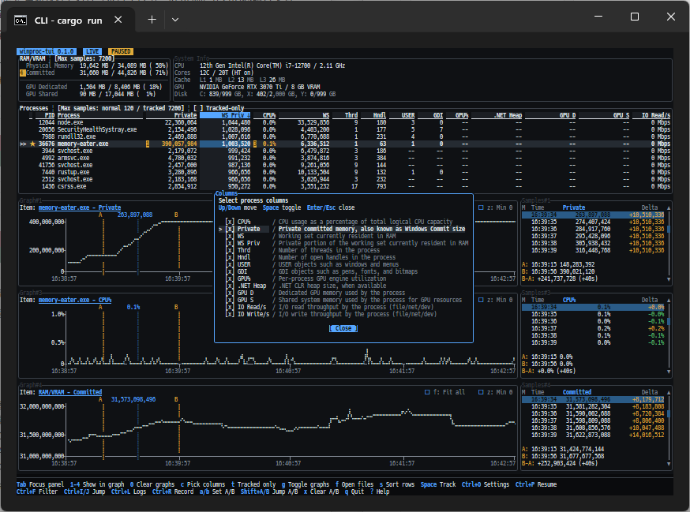

# winproc-tui

[](LICENSE)
[](#動作環境)
[](https://www.rust-lang.org/)

言語: [English](README.md) | [日本語](README.ja.md)

このリポジトリは `winproc-tui` のオリジナルの upstream リポジトリです。
第三者によるコピー、ミラー、改変リポジトリは公式のプロジェクトリポジトリではありません。

`winproc-tui` は、**プロセスごとのリソース使用量を時系列で確認するための TUI プロセス監視ツール** です。
ターミナルから起動し、メモリ・ハンドル・GUI リソース・GPU メモリ・I/O などの現在値と時間変化を確認できます。最大 4 つの Graph、A/B 比較、JSON Lines 形式のログ記録と Playback を備えており、開発・検証時のリソース挙動や日常的なトラブルシュートを短時間で把握するのに向いています。Process Explorer や System Informer のように網羅性で勝負するのではなく、「いま見ているプロセスが、どんなリソースをどのタイミングでどの程度使っているか」を素早く掴むことに振り切ったツールです。Rust/Ratatui で作られています。



## 主な機能

- **モニタ**: RAM / VRAM、ネットワークとディスクの状態、平均 CPU 使用率と論理 CPU 別負荷を示すコンパクトな CPU パネル、プロセスごとの主要メトリクスをテーブル表示。ソート、列選択、フィルター、ジャンプ検索で対象を絞り込めます。
- **グラフ表示**: 選択したメトリクスを最大 4 つの Graph / Samples スロットに並べ、時系列の推移とサンプル値を確認できます。通常プロセスは約 120 秒、追跡中プロセス、RAM / VRAM、平均 CPU 使用率は約 7,200 秒の履歴を保持します。
- **追跡 (Tracked List)**: 関心のあるプロセス名を登録し、追跡中のものだけを表示できます。プロセスが終了したあとも最後に取得した値が画面に残ります。
- **ログ記録と Playback**: 追跡中のプロセス、RAM / VRAM、平均 CPU 使用率、システム状態を JSON Lines ログとして保存し、あとから同じ Processes / Graph / Samples / A/B の画面構成で再調査できます。
- **A/B 比較**: 任意の 2 時点を A 点・B 点としてマークし、値の差分と経過時間を表示します。
- **Open files**: 選択中の稼働プロセスが開いているファイルを一覧表示します。
- **操作支援**: `Ctrl+C` で選択行をクリップボードへコピー、`F2` でテーマ切替、マウスでの行選択やスクロールバー操作にも対応しています。

Processes テーブルでは、サンプルごとの増減を色分けせず、通常のメトリクス値と Tracked Total 行を中立色で表示します。青はフォーカスと選択を示します。追跡・Graph スロット・フィルター一致・警告は、背景を塗らずアンバーの文字や記号で示し、赤と緑は危険 / エラーと操作成功のフィードバックに限定します。
Processes のタイトルには、表示行数、All processes / Tracked only、適用中のフィルターを簡潔に表示します。ソートカラムと方向はテーブルヘッダーだけに表示し、固定の履歴保持数はパネルタイトルには常時表示せず Help で確認できます。

## こんなときに役立ちます

- アプリのリソース使用量の推移やメモリリークの有無を把握したい。
- 特定の処理でどの程度リークしているのか数値で把握したい(2地点の差分)。
- ファイルのクローズ漏れを検出したい。どのファイルを開いているのか把握したい。
- バックグラウンドサービスを **長時間記録** し、現象が起きた付近を Playback で見直したい。
- リファクタの前後でリソース使用量を比較したい。

## 動作環境

- OS: Windows 11 x64

Windows 専用です。Linux / macOS など他のプラットフォームには対応していません。

## ビルド済みバイナリを使う

[GitHub Releases](https://github.com/TX230/winproc-tui/releases) から入手します。
ダウンロードした zip を任意のフォルダに展開し、`winproc-tui.exe` を実行してください。追加のランタイムやインストーラは不要です。

公式のビルド済みバイナリは [TX230/winproc-tui Releases](https://github.com/TX230/winproc-tui/releases) からのみ公開します。第三者によるコピー、ミラー、改変リポジトリで配布されるバイナリは公式ビルドではありません。

zip ファイルの SHA256 ハッシュ値を計算するコマンドは以下のとおりです。

```powershell
Get-FileHash .\winproc-tui-X.Y.Z-windows-x64.zip -Algorithm SHA256
```

表示された `Hash` の値を、公式 GitHub Releases ページの `.zip` アセット横に表示される `sha256:` digest と比較してください。

## ソースからビルドする

開発中のコードを試したい場合は、ソースからビルドできます。

### 1. Rust ツールチェインを用意する

Windows では [rustup](https://rustup.rs/) の利用を推奨します。ビルドには Rust 1.95.0 以降と Rust 2024 edition、MSVC リンカー（Build Tools for Visual Studio 2026 の C++ ツールチェイン）が必要です。

winget を使う場合:

```powershell
winget install --id Rustlang.Rustup -e
winget install --id Microsoft.VisualStudio.BuildTools -e --override "--add Microsoft.VisualStudio.Workload.VCTools --includeRecommended --quiet --wait --norestart"
```

導入確認:

```powershell
rustup --version
rustc --version
cargo --version
```

### 2. ビルドして実行する

```powershell
git clone https://github.com/TX230/winproc-tui.git
cd winproc-tui
cargo build --release
```

実行ファイルは `target\release\winproc-tui.exe` に生成されます。
ビルド後は次のいずれかで起動できます。

```powershell
cargo run --release
# またはビルド済みバイナリを直接実行
.\target\release\winproc-tui.exe
```

### 3. コマンドとしてインストールする（任意）

`cargo install --path .` を実行しておくと、ユーザーごとの cargo bin ディレクトリ（既定では `%USERPROFILE%\.cargo\bin`）に `winproc-tui.exe` がインストールされます。このディレクトリは PATH に含まれているため、以降は任意の場所で `winproc-tui` と入力するだけで起動できます。

```powershell
cargo install --path .
winproc-tui
```

## 起動オプション

起動オプションは現時点では以下の2つのみです。


| オプション           | 説明          |
| --------------- | ----------- |
| `-h, --help`    | ヘルプを表示する。   |
| `-V, --version` | バージョンを表示する。 |


## 操作

README には主要キーのみを掲載します。**実行中に** `?` **を押すと、現在割り当てられている全キーをヘルプダイアログで確認できます。**

`f` のような 1 文字キーは、フォーカス中のパネルによって動作が変わります。1 行のフッターには現在のパネルと主な操作が表示されます。下の表にはパネルごとの全操作を掲載しています。

### 基本


| キー                  | 動作                             |
| ------------------- | ------------------------------ |
| `?`                 | ヘルプの表示 / 非表示。                  |
| `q` / `Esc`         | 終了確認を開く(Playback 中は live 表示へ戻る)。 |
| `Tab` / `Shift+Tab` | フォーカス移動。                       |
| `Ctrl+C`            | フォーカス中パネルの選択行テキストをコピー。         |
| `Ctrl+L`            | ログ一覧を開く。                       |
| `Ctrl+R`            | 記録の開始 / 停止。                    |
| `Ctrl+P`            | 画面更新の一時停止 / 再開。                |
| `Ctrl+O`            | Settings ダイアログを開く。             |
| `Ctrl+Wheel`        | Windows Terminal のズーム倍率を変更。     |
| `F2`                | テーマ切替。                         |


### プロセス操作


| キー                  | 動作                                      |
| ------------------- | --------------------------------------- |
| `Ctrl+F`            | プロセス名でフィルタリングする。`Full Path` 列を選択しているときは実行ファイルパスも対象にする。 |
| `Ctrl+I` / `Ctrl+J` | プロセス名のインクリメンタル検索。                       |
| `1` 〜 `4`           | 選択中のプロセス、RAM / VRAM、NW/DISK Activity、または CPU Usage メトリクスを Graph#1〜#4 に表示する（同じ番号を再押下で解除）。 |
| `0`                 | 全 Graph を解除して Graph パネルを閉じる。            |
| `s`                 | 選択カラムでソート（再押下で昇順 / 降順切替）。               |
| `c`                 | カラムピッカーを開く。                             |
| `Shift+Up/Down`     | 稼働中プロセス行を連続範囲で選択する。                     |
| `Ctrl+Up/Down`      | 複数選択を変えずにカーソルだけ移動する。                    |
| `Ctrl+Space`        | 現在の稼働中プロセス行を複数選択に追加 / 削除する。             |
| `Shift+Left/Right`  | 選択中のメトリクスカラムを左 / 右へ移動する。                |
| `Space`             | 選択プロセス名を Tracked List に追加 / 削除。         |
| `d` / `Delete`      | 確認後、選択した稼働中プロセス行を `taskkill /f /im` で終了する。 |
| `t`                 | 追跡中のみ表示するかを切り替える。                       |
| `Enter`             | 選択中プロセスの Process Info を開く。              |
| `i`                 | System Info ダイアログを開く。 |
| `f`                 | 選択中の稼働プロセスの Open files を開く。             |
| `g`                 | 設定済みの全 Graph を一括で開く / 閉じる。              |


### Graph と A/B 比較


| キー                         | 動作                           |
| -------------------------- | ---------------------------- |
| `Left` / `Right`           | 選択サンプルを移動。                   |
| `Ctrl+Left` / `Ctrl+Right` | 表示範囲を左右に移動。                  |
| 右ドラッグ / `Ctrl`+左ドラッグ      | マウスで表示範囲を左右に移動。              |
| `PageUp` / `PageDown`      | 表示する時間幅を変更。                  |
| `f`                        | 全サンプルが収まる時間幅へ切り替え。           |
| `z`                        | Y 軸下限を 0 固定 / 表示範囲の最小値に切り替え。 |
| `a` / `b`                  | 選択サンプルを A 点 / B 点としてマーク。     |
| `Shift+A` / `Shift+B`      | A 点 / B 点へジャンプ。              |
| `x`                        | A/B 比較をクリア。                  |


複数 Graph を表示するときは、表示時間幅と A/B 点がスロット間で共有され、Y 軸スケールは Graph ごとに独立します。表示領域が足りない場合は `Not enough display area.` と表示され、その Graph は追加されません。

## 記録と Playback

`Ctrl+R` で記録の開始と停止を切り替えます。記録を開始するには Tracked List に 1 件以上の名前が必要です。ログは JSON Lines として保存されます（拡張子 `.log`）。各フレームには RAM / VRAM、平均 CPU 使用率、System Activity などのシステム指標と、Tracked List に一致する実行中プロセスが記録されます。一致するプロセスがその時点で存在しない場合も、システム指標は記録され、プロセス一覧は一致するプロセスが現れるまで空になります。記録開始時に保存先パスの入力ダイアログが開き、`Tab` でディレクトリ名を補完できます。Playback 中は記録を開始できず、記録中は Playback を開始できません。

`Ctrl+L` でログ一覧を開きます。前回の記録ディレクトリがあればそこ、なければカレントディレクトリの `*.log` を表示します。`Dir` 行で検索中のディレクトリを確認でき、`d` で別ディレクトリを指定できます。選択したログを `Enter` で開くと表示が `PLAY` に切り替わり、Processes / Graph / Samples / A/B 比較で過去のセッションを調査できます。  
Playback は実時間再生ではなく、保存済みセッションを閲覧するビューアーです。`Esc` で live 表示へ戻ります。

記録ログのフォーマットと各フィールドの意味は [docs/metrics.md](docs/metrics.md) を参照してください。

## 設定ファイル

設定ファイルは、実行ファイルと同じディレクトリに置かれる `winproc-tui.toml` です。ファイルが無ければ既定値で起動します。アプリの終了時には、テーマ・プロセス表のカラム・ソート・Tracked Only・追跡リストが保存されます。フィルター入力の状態は次回起動に引き継ぎません。

例:

```toml
[general]
mouse = true
theme = "Dark"

[process_table]
preset = "Default"
columns = ["Private", "WS Priv"]
sort_by = "WS Priv"
sort_order = "desc"
tracked_only = false

[[tracked]]
name = "app.exe"
```

サンプリング間隔は現バージョンでは 1 秒固定で、設定ファイルからは変更できません。

## 開発者向けドキュメント

- [docs/metrics.md](docs/metrics.md): メトリクス、取得元、表示形式。
- [docs/architecture.md](docs/architecture.md): アーキテクチャ、責務分担、データフロー。

## 非目標

`winproc-tui` は次を目指しません。

- Process Explorer や System Informer の全面的な代替。
- 管理者権限を前提にした詳細取得。

短時間の開発・検証セッションで、プロセスの変化を素早く観察するためのツールです。

## バグ報告・要望

不具合報告と機能要望は GitHub Issues へお願いします。
バグ報告 / 機能要望それぞれのテンプレートを用意しています。

個人開発のプロジェクトのため、外部コントリビューターからの未依頼の Pull Request は受け付けていません。フィードバックや機能要望は Issue をご利用ください。

Issue は日本語・英語のどちらでも構いません。ユーザー向け README は日英の 2 言語で維持していますが、`docs/` 配下の詳細な仕様ドキュメントは英語のみで維持しています。

## ライセンス

MIT License。詳細は [LICENSE](LICENSE) を参照してください。
