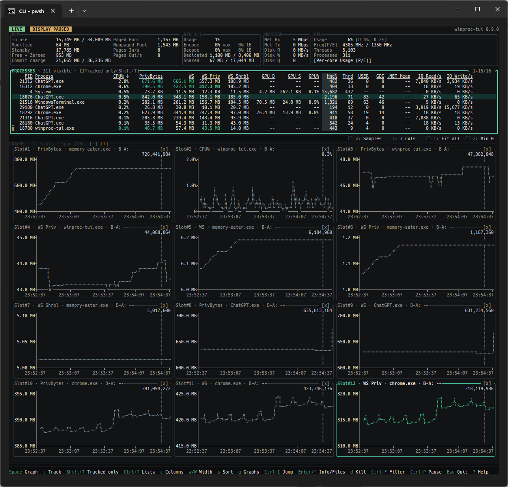

# winproc-tui

[](LICENSE)
[](#動作環境)
[](https://www.rust-lang.org/)

言語: [English](README.md) | [日本語](README.ja.md)

`winproc-tui` は、Windows プロセスのリソース使用量の変化を追う、キーボード中心の TUI モニタリングツールです。アプリのメモリ、ハンドル、GUI リソース、GPU メモリ、I/O などをターミナル上で時系列に確認できます。

必要なメトリクスを最大 16 個の Graph に並べ、A/B マーカーで正確に比較し、セッションを記録してあとから調査できます。汎用的なシステム管理ではなく、開発・検証中に選択したプロセスを素早く繰り返し調べることに特化しています。


_システムの状態とともにプロセスのプライベートメモリ増加を表示し、A と B で比較区間を指定している例です。_

## インストール

Windows 用の公式バイナリは [TX230/winproc-tui Releases](https://github.com/TX230/winproc-tui/releases) でのみ公開します。WinGet と [TX230 Scoop Bucket](https://github.com/TX230/scoop-bucket) は、どちらも同じ Release バイナリをインストールします。コピー、ミラー、改変リポジトリで配布されるものは公式ビルドではありません。

### WinGet

```powershell
winget install --id TX230.winproc-tui -e
winproc-tui
```

更新とアンインストール:

```powershell
winget upgrade --id TX230.winproc-tui -e
winget uninstall --id TX230.winproc-tui -e
```

### Scoop

```powershell
scoop bucket add tx230 https://github.com/TX230/scoop-bucket
scoop install tx230/winproc-tui
winproc-tui
```

登録済み Bucket を更新してから、アプリを更新します。

```powershell
scoop update
scoop update winproc-tui
```

アンインストールには `scoop uninstall winproc-tui` を使用します。通常は保存済み設定が保持されます。設定も削除する場合は `scoop uninstall --purge winproc-tui` を使用してください。

## クイックスタート

### プロセスの変化を Graph で見る

1. `PROCESSES` で調べたいプロセスを選びます。
2. `Left` / `Right` で `PrivBytes` などのメトリクスカラムを選びます。
3. `Space` を押すかメトリクスセルをダブルクリックして Graph を追加します。ほかのメトリクスでも繰り返すと、最大 16 個の Graph を同じワークスペースで比較できます。

システムの MEM、GPU、CPU、ネットワーク / ディスクは、Tracking List に登録しなくても各パネルから直接 Graph に追加できます。



_プロセスとシステムの概要を残したまま、12 個のメトリクスを 3 列で比較している例です。_

### 2 時点を比較する

Graph または Samples にフォーカスを移し、`Left` / `Right` でサンプルを選びます。開始点で `a`、終了点で `b` を押すと、値の差と経過時間を確認できます。`x` で比較を解除します。

### プロセスを追跡・記録する

1. Process または PID セルを選び、`Space`、ダブルクリック、または `t` でプロセス名を作業中の Tracking List へ追加します。
2. 繰り返し使う対象は、`Ctrl+T` から名前付き Tracking List として保存・読み込みできます。
3. `Ctrl+R` を押し、保存先と `1s` / `2s` / `5s` / `10s` の記録間隔を選んで開始します。
4. もう一度 `Ctrl+R` を押し、`y` で記録を終了します。`Enter`、`Esc`、`n` では記録を継続します。
5. `Ctrl+L` から保存済みログを開き、あとから調査します。

記録には Tracking List へのプロセス名の登録が 1 件以上必要ですが、一致するプロセスがまだ起動していなくても開始できます。対象名は記録開始時に確定し、そのセッション中は変わりません。`Shift+T` の All processes / Tracked-only 切り替えは表示だけを変更するため、記録中も使用できます。

`Tab` / `Shift+Tab` でパネルを移動し、方向キーで行、カラム、サンプルを選びます。`F1` または `?` で全操作を確認でき、Footer には現在の状況で使える主要操作が表示されます。

## 主な機能

- **ライブモニタリング**: システムのメモリ負荷、GPU アダプター別の負荷とメモリ、ネットワーク / ディスク、CPU、プロセス別の詳細メトリクスを表示します。
- **Graph と A/B 比較**: 最大 16 個のメトリクスを順序付きのワークスペースへ並べ、同期した Samples から任意の 2 時点を正確に比較します。
- **Tracking Lists**: プロセス名の組み合わせを名前付きで保存し、Tracked-only 表示へ切り替えられます。追跡中のプロセスが終了したあとも最後の値を保持します。
- **.NET メトリクス**: 実行中の .NET 8 / 9 / 10 プロセスを自動検出してマネージドランタイムのメトリクスを表示し、.NET Framework 4.8 の一部ヒープメトリクスにも対応します。
- **Process Info**: 選択したプロセスのメトリクス、イメージとランタイム、開いているファイル、DLL、環境変数を 1 つのダイアログから調査できます。
- **記録と Log view**: システムメトリクスと一致するプロセスを JSON Lines で保存し、同じ Processes、Graph、Samples、A/B の画面から再調査できます。

レイアウト、表示カラム、ソート、Tracking Lists は次回起動時に復元されます。フィルター入力は保存しません。

## 向いている用途

`winproc-tui` は次のような調査に適しています。

- プロセスのメモリやハンドル使用量が増え続けていないか調べる。
- 特定の処理やコード変更の前後でリソース使用量を測る。
- プロセスが使用しているファイル、DLL、ランタイムを確認する。
- バックグラウンドサービスを記録し、あとから現象発生付近の履歴を調べる。

任意のカウンター、リモート監視、Data Collector Sets の管理には、Windows 標準のパフォーマンス監視ツールである PerfMon が適しています。システム全体を網羅的に調べる場合は、Process Explorer や System Informer が適しています。`winproc-tui` は、選択したプロセスの直近の挙動を素早く繰り返し比較する用途に向いています。

## 記録と Log view

記録対象の名前は、開始時点の作業中 Tracking List に固定されます。一致するプロセスが実行されていなくても、システムのメモリ、GPU アダプター別メトリクス、CPU 集計値、ネットワーク / ディスクは記録され、プロセス一覧だけが空になります。

Live の収集と履歴は 1 秒間隔のままです。長い記録間隔では取得できたサンプルを平均するため、ファイルサイズと Log view の読み込み負荷が減る一方、短時間のスパイクは平滑化されます。1 回の記録は最大 24 時間で、上限に達すると自動的に Live へ戻ります。

Log view はフレームを再生する機能ではありません。プロセスの最終スナップショットを表示し、Graph、Samples、Process Info、A/B 比較から記録済み履歴を調査します。記録と Log view は同時に使用できません。

メトリクスの定義、集約方法、記録フォーマットは [docs/metrics.md](docs/metrics.md) を参照してください。

## 動作環境

- Windows 11 x64 のみ。Linux と macOS には対応していません。

通常の監視に管理者権限は不要です。保護されたプロセスでは、Process Info の一部や開いているファイルの一覧を取得できない場合があり、取得できない値は `--` で表示されます。

同じ Windows セッション内で起動できる `winproc-tui` は 1 つだけです。2 つ目は、起動中のターミナルや保存済みセッション設定を変更せず終了します。

## ソースからビルドする

ビルドには Rust 1.95.0 以降、Rust 2024 edition のツールチェイン、Build Tools for Visual Studio 2026 の MSVC リンカーが必要です。[rustup](https://rustup.rs/) で Rust を導入してからビルドします。

```powershell
git clone https://github.com/TX230/winproc-tui.git
cd winproc-tui
cargo build --release
.\target\release\winproc-tui.exe
```

Rust 開発者は、現在のチェックアウトをコマンドとしてインストールすることもできます。

```powershell
cargo install --path .
```

## 詳細情報

- アプリ内で `F1` または `?` を押すと、キーボードとマウスの全操作を確認できます。
- `winproc-tui --help` で起動オプションを確認できます。
- [docs/metrics.md](docs/metrics.md): メトリクス、取得元、表示形式、記録ログ。
- [docs/architecture.md](docs/architecture.md): システム全体の構成と、機能別設計書へのリンク。

## バグ報告・要望

不具合報告と機能要望は [GitHub Issues](https://github.com/TX230/winproc-tui/issues) へお願いします。Issue は日本語と英語のどちらでも構いません。

セキュリティ脆弱性の疑いがある場合は、公開 Issue ではなく [SECURITY.md](SECURITY.md) の手順で非公開報告してください。

個人開発のプロジェクトのため、外部コントリビューターからの未依頼の Pull Request は受け付けていません。Issue の作成や議論は、Pull Request の依頼を意味しません。詳細は [CONTRIBUTING.md](CONTRIBUTING.md) を参照してください。

## ライセンス

MIT License。詳細は [LICENSE](LICENSE) を参照してください。
