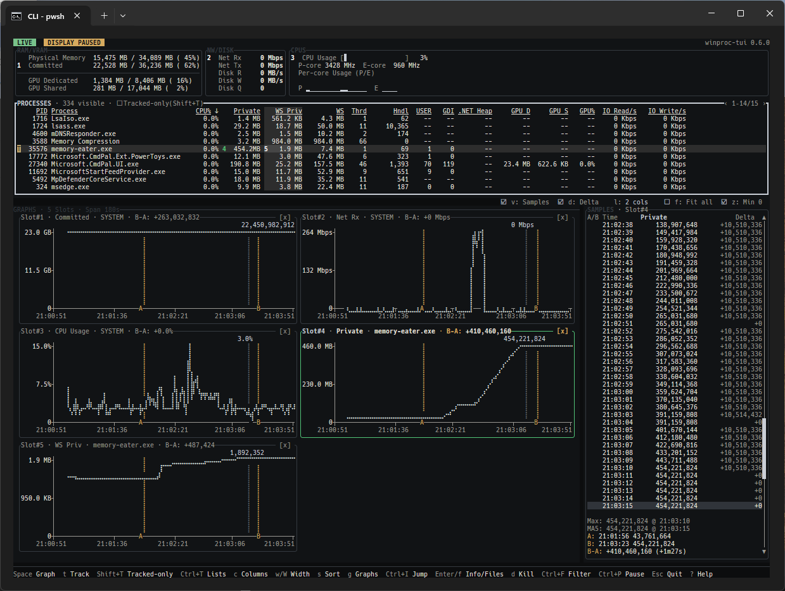

# winproc-tui

[](LICENSE)
[](#requirements)
[](https://www.rust-lang.org/)

Languages: [English](README.md) | [Japanese](README.ja.md)

`winproc-tui` is a **process monitoring TUI** for tracking per-process resource usage over time.
It shows current values and changes over time for memory, handles, GUI resources, GPU memory, I/O, and other Windows process metrics. Up to 16 Graphs, A/B comparison, recording, and saved-log review support resource-behavior investigations during development and verification.
Rather than providing the broad system inspection of Process Explorer or System Informer, it focuses on quickly following changes in a specific process. It is built with Rust/Ratatui.



_Investigating private memory growth alongside system activity and comparing two points with A/B markers._

## Quick Start

### 1. Launch the App

Install and launch the app with WinGet:

```powershell
winget install --id TX230.winproc-tui -e
winproc-tui
```

Only one `winproc-tui` instance can run in a Windows session. If one is already running, another launch exits before changing the terminal or loading session settings.

The upper panels show system-wide memory, per-adapter GPU activity and memory, network / disk activity, and CPU usage. The `PROCESSES` panel lists running processes. Use `Tab` / `Shift+Tab` to move between panels, including separate focus stops for MEM and GPU, and the arrow keys to select rows and columns.

MEM, GPU, average CPU usage, and NW/DISK System Activity retain history automatically from startup without registering a process name. The Tracking List applies only to process names. With MEM or GPU focused, use `m` / `g` to jump directly between them. `Left` / `Right` moves between the two MEM columns or changes the GPU adapter.

### 2. Graph Process Metrics

1. In `PROCESSES`, select the process you want to inspect.
2. Use `Left` / `Right` to select the metric column you want to inspect. For example, `PrivBytes` is memory committed privately by the process.
3. Press `Space`, or double-click the metric cell, to add it to the Graph Workspace. Repeat the same operation to remove it.
4. Repeat the operation on other metrics to compare up to 16 Graphs. The active card stays visible as you move through the ordered list.

`Space` and double-click both add or remove only the selected Graph. The same controls work for selectable metrics in the MEM, GPU, and NW/DISK panels and for CPU Usage in CPUS. Registered sources show their Graph slot number.

### 3. Compare Two Points

Move focus to a Graph or Samples table, then use `Left` / `Right` to select a sample. Press `a` at the start point and `b` at the end point. The A/B display shows the value difference and elapsed time. Press `x` to clear the comparison.

### 4. Track and Record a Process

1. In `PROCESSES`, select a process. If there is no reverse-video `T` beside its name, press `t` to add the name to the Tracking List. `t` toggles the registration.
2. For targets you use repeatedly, press `Ctrl+T` and save the Tracking List with a name.
3. If needed, press `Shift+T` to switch between All processes and Tracked-only. Tracked-only view is not required for recording.
4. Press `Ctrl+R`, choose a save path, and confirm to start recording.
5. Press `Ctrl+R` again, then confirm `Stop` to stop recording and close the log. The default `Continue` action leaves recording active.
6. Press `Ctrl+L` to select and inspect a saved log.

Recording requires at least one process name in the Tracking List. It can still start when no matching process is currently running. MEM, per-adapter GPU, average CPU usage, and System Activity require no registration and are recorded in every frame; the process list remains empty until a match appears.
The recording start dialog shows how many names will be captured. That Tracking List is fixed for the session: `t` and `Ctrl+T` are unavailable until recording stops, while `Shift+T` can still change only the Tracked-only display.

The Tracking Lists dialog loads, saves, renames, and deletes named process lists. `Empty (default)` clears the working list without changing Tracked-only. Loading a list may ask for confirmation before discarding retained history for removed names. Press `?` in the app for the complete dialog controls.

When startup behavior is set to `Choose list`, the startup screen uses `Up` / `Down` to select a Tracking List and `Tab` / `Shift+Tab` to move focus through the list, `[ Start ]`, and `[ Quit ]`. `Enter` activates the focused choice or button. `Esc` exits without collecting the initial sample.

Use `Ctrl+C` on a selected process, system metric, or Samples row to copy plain text into an issue or investigation note. For longer investigations, keep the `.log` file and reopen it with `Ctrl+L`.

### Essential Keys

| Key                 | Action                                      |
| ------------------- | ------------------------------------------- |
| `Tab` / `Shift+Tab` | Move between panels.                        |
| Arrow keys          | Select a row, column, or sample.            |
| `Space`             | Add/remove the selected metric Graph.       |
| `t`                 | Add/remove a process name in Tracking List (Live only). |
| `Shift+T`           | Switch between All processes / Tracked-only. |
| `Ctrl+T`            | Open named Tracking Lists (Live only).      |
| `Ctrl+F`            | Filter the process list.                    |
| `Ctrl+R`            | Start recording / confirm stopping.         |
| `Ctrl+L`            | Open a saved log.                           |
| `?`                 | Show all key bindings.                      |
| `q` / `Esc`         | Go back or open the quit confirmation.      |

## Features

- **Monitoring**: Shows two pages of memory pressure metrics, per-adapter GPU/Encode/Decode load and memory, network and disk activity, a compact CPU panel, and key per-process metrics including `WS Shrbl`. Sorting, column selection, filtering, and jump search help you narrow down the target.
- **Graphing**: Keeps up to 16 selected metrics in an ordered, scrollable Graph Workspace with one synchronized Samples inspector and recent history for comparison.
- **Tracking Lists**: Registers process names of interest and can show only tracked rows. Lists can be named, saved, and switched for different tasks, and startup can resume the last working list, choose a saved list, or start empty. Last collected values remain visible after processes exit. MEM, GPU, average CPU usage, and System Activity always retain history without registration.
- **Recording and Log view**: Saves tracked processes, MEM, per-adapter GPU, CPU average, and system activity values as JSON Lines logs and opens them later in the same Processes / Graph / Samples / A/B layout.
- **A/B comparison**: Marks any two points as A and B, then shows the value difference and elapsed time between them.
- **Process investigation**: Opens a responsive, tabbed Process Info dialog for metrics, executable details, and files currently open by the selected live process.
- **Interaction support**: `Ctrl+C` copies the selected row to the clipboard, and mouse-based row selection and scrollbars are supported.

## When This Helps

- You want to investigate whether an application's memory usage keeps increasing.
- You want to measure how memory or handle counts change before and after an operation.
- You want to inspect currently open files for clues when investigating missed file closes.
- You want to **record a background service over a long period** and review the area around an incident in Log view.
- You want to compare resource usage before and after a refactor.

## Why Use This Instead of PerfMon?

PerfMon, the performance monitoring tool built into Windows, is suited to broad counter selection and Data Collector Sets. `winproc-tui` is intentionally narrower: select a running process and metric directly, retain recent history without configuring counters, compare exact A/B points, and reopen recorded sessions in the same interface.

Use PerfMon when you need arbitrary counter configuration, remote monitoring, or system-wide collector management. Use `winproc-tui` when you need a fast, keyboard-first investigation of how a specific process changes during development or verification.

## Requirements

- OS: Windows 11 x64

This project is Windows-only. Linux, macOS, and other platforms are not supported.

Administrator privileges are not required for normal monitoring. Some process details and open files may be unavailable for protected processes; unavailable values are displayed as `--` or a diagnostic state.

## Use a Prebuilt Binary

### Install with WinGet

```powershell
winget install --id TX230.winproc-tui -e
```

After installation, run `winproc-tui` from any directory. Use these commands to update or uninstall it:

```powershell
winget upgrade --id TX230.winproc-tui -e
winget uninstall --id TX230.winproc-tui -e
```

After a new GitHub Release, publication of the corresponding version to the WinGet catalog may take some time. During that interval, `winget install` may install an older version. Check the catalog version with `winget show --id TX230.winproc-tui -e`; if it is older than the latest Release, wait for the catalog update or use the zip from GitHub Releases. The TX230 Scoop Bucket does not go through WinGet catalog review or publication. After its manifest is updated, run `scoop update` below to refresh your local bucket and use the latest version without waiting for WinGet.

### Install with Scoop (TX230 Bucket)

```powershell
scoop bucket add tx230 https://github.com/TX230/scoop-bucket
scoop install tx230/winproc-tui
```

After installation, run `winproc-tui` from any directory. To update, first run `scoop update` to refresh the local manifests for registered buckets, then run `scoop update winproc-tui`. Running only `scoop update tx230/winproc-tui` may not detect the latest version when the local TX230 Bucket is stale. Use these commands to update or uninstall it:

```powershell
scoop update
scoop update winproc-tui
scoop uninstall winproc-tui
```

A normal uninstall preserves the application settings. To remove them as well, use `scoop uninstall --purge winproc-tui`.

The TX230 Bucket downloads the zip from the official GitHub Release, verifies its SHA256 hash, and registers the `winproc-tui` command. No additional runtime is required.

### Extract the zip manually

Download the zip from [GitHub Releases](https://github.com/TX230/winproc-tui/releases), extract it to any folder, and run `winproc-tui.exe`. No additional runtime or installer is required.
The release zip contains only `winproc-tui.exe` and `LICENSE`. Documentation remains on GitHub.

Official release binaries are published only from [TX230/winproc-tui Releases](https://github.com/TX230/winproc-tui/releases). The WinGet package and [TX230 Scoop Bucket](https://github.com/TX230/scoop-bucket) use these Release binaries.
Binaries from third-party copies, mirrors, or modified repositories are not official builds.

Download both the zip and its corresponding `.zip.sha256` file from the Release. Use these PowerShell commands to calculate the zip's SHA256 hash and display the published value:

```powershell
Get-FileHash .\winproc-tui-X.Y.Z-windows-x64.zip -Algorithm SHA256
Get-Content .\winproc-tui-X.Y.Z-windows-x64.zip.sha256
```

Confirm that the `Hash` value from `Get-FileHash` matches the leading hash value in `.zip.sha256`.

## Build From Source

If you want to try in-development code, you can build from source.

### 1. Install the Rust Toolchain

On Windows, [rustup](https://rustup.rs/) is recommended.
Building requires Rust 1.95.0 or later, the Rust 2024 edition, and the MSVC linker (the C++ toolchain from Build Tools for Visual Studio 2026).

Using winget:

```powershell
winget install --id Rustlang.Rustup -e
winget install --id Microsoft.VisualStudio.BuildTools -e --override "--add Microsoft.VisualStudio.Workload.VCTools --includeRecommended --quiet --wait --norestart"
```

Verify the installation:

```powershell
rustup --version
rustc --version
cargo --version
```

### 2. Build and Run

```powershell
git clone https://github.com/TX230/winproc-tui.git
cd winproc-tui
cargo build --release
```

The executable is generated at `target\release\winproc-tui.exe`.
The repository's Cargo configuration statically links the Microsoft C runtime into Windows x64 builds.
After building, launch it in either of the following ways:

```powershell
cargo run --release
# or run the built binary directly
.\target\release\winproc-tui.exe
```

### 3. Install as a Command (Optional)

Running `cargo install --path .` installs `winproc-tui.exe` into your per-user cargo bin directory (by default `%USERPROFILE%\.cargo\bin`).
That directory is on your PATH, so afterwards you can launch the tool from anywhere by simply typing `winproc-tui`.

```powershell
cargo install --path .
winproc-tui
```

## Command-Line Options

There are currently only two startup options.


| Option          | Description   |
| --------------- | ------------- |
| `-h, --help`    | Show help.    |
| `-V, --version` | Show version. |


## Controls Reference

Only the main controls are listed in this README.
**Press** `?` **while running to view the full key bindings in the Help dialog.**

Some single-letter keys such as `f` depend on the focused panel. The Footer shows the main actions available in the current context; the tables below summarize them by panel.

### General


| Key                 | Action                                                              |
| ------------------- | ------------------------------------------------------------------- |
| `?`                 | Show / hide Help.                                                   |
| `q` / `Esc`         | Open the quit confirmation (returns to live display from Log view). |
| `Tab` / `Shift+Tab` | Move focus.                                                         |
| `Ctrl+C`            | Copy the selected row text from the focused panel.                  |
| `Ctrl+L`            | Open the log list.                                                  |
| `Ctrl+T`            | Open Tracking Lists to load the built-in empty list, manage named lists, and set startup behavior (Live only). |
| `Ctrl+R`            | Start recording or open the stop confirmation.                     |
| `Ctrl+P`            | Pause / resume display updates; sampling and recording continue (unavailable in Log view). |
| `Ctrl+Wheel`        | Change the Windows Terminal zoom level.                             |


### Process Controls


| Key                 | Action                                                                                |
| ------------------- | ------------------------------------------------------------------------------------- |
| `Ctrl+F`            | Filter the process list by name, or by executable path when the `Full Path` column is selected. |
| `Ctrl+I` / `Ctrl+J` | Process-name incremental search.                                                      |
| `Space`             | Add or remove the selected graphable process, MEM, GPU, NW/DISK, or CPU Usage metric in the Graph Workspace. |
| `s`                 | Sort by the selected column (press again to switch ascending / descending).           |
| `c`                 | Open the column picker.                                                               |
| `Shift+Up/Down`     | Select a continuous range of live process rows.                                       |
| `Ctrl+Up/Down`      | Move the cursor without changing the multi-selection.                                 |
| `Ctrl+Space`        | Add or remove the current live process row from the multi-selection.                  |
| `Shift+Left/Right`  | Move the selected metric column left or right.                                        |
| `w` / `Shift+W`     | Widen or narrow the selected column by one cell.                                      |
| `t`                 | Add or remove the selected process name from the Tracking List (Live only).           |
| `Shift+T`           | Toggle Tracked-only display.                                                          |
| `d` / `Delete`      | Confirm, then kill the selected live process rows with `taskkill /f /im`.             |
| `Enter`             | Open Process Info for the selected process.                                          |
| `i`                 | Open the System Info dialog.                                                        |
| `f`                 | Open Process Info directly on the Files tab for the selected live process.            |
| `g`                 | Open or close all configured Graphs at once.                                          |

Process Info has `Metrics`, `Image`, `Files`, `DLLs`, and `Environment` tabs. Use `Ctrl+Right` / `Ctrl+Left` to switch tabs, `Ctrl+U` to refresh dynamic tabs, and `Ctrl+C` to copy the selected value. Dynamic details may be unavailable for protected, unsupported, or exited processes.

When A/B points are set, `Metrics` shows Current − A or B − A using exact-time samples. Environment values can contain secrets; they are cleared when the dialog closes and are never added to recordings or Log view.


### Graph and A/B Comparison


| Key                        | Action                                                                              |
| -------------------------- | ----------------------------------------------------------------------------------- |
| `Enter`                    | Open Process Info for the active process Graph.                                     |
| `Up`                       | Select the previous Graph slot.                                                     |
| `Down`                     | Select the next Graph slot.                                                         |
| `Delete`                   | Remove the active Graph.                                                            |
| `Left`                     | Select the older sample.                                                            |
| `Right`                    | Select the newer sample.                                                            |
| `Ctrl+Left` / `Ctrl+Right` | Pan the visible range.                                                              |
| Right drag / `Ctrl`+left drag | Pan the visible range with the mouse.                                            |
| `PageUp` / `PageDown`      | Change the visible time span with Graph focus; move by page with Samples focus.     |
| Title `[-]` / `[+]`        | Expand or narrow the shared visible time span with the mouse.                       |
| `f`                        | Switch to one shared time range that fits all samples across the registered Graphs. |
| `z`                        | Toggle the Y-axis lower bound between fixed at 0 and following the visible minimum. |
| `v`                        | Show or hide the Samples table.                                                     |
| `d`                        | Show or hide the Delta column in Samples.                                           |
| `l`                        | Cycle Graph layout through Auto, one, two, and three columns.                       |
| `a` / `b`                  | Mark the selected sample as point A or point B.                                     |
| `Shift+A` / `Shift+B`      | Jump to point A or point B.                                                         |
| `x`                        | Clear the A/B comparison.                                                           |
| Mouse wheel                | Scroll Graph rows; over Samples, scroll sample rows.                                |


The Graph Workspace keeps up to 16 ordered cards. `Up` / `Down`, card clicks, the mouse wheel, and the scrollbar select a Graph; `Delete` or a card's `[x]` removes it. The title `[-]` / `[+]` controls and each card's `[x]` highlight on mouse hover. The single Samples inspector follows the active Graph, and the shared shortcuts work from either Graph or Samples focus.

Multiple Graphs share one absolute visible time range, cursor, selected time, and A/B points. `Fit all` covers the earliest through latest samples across the registered Graphs, including Graphs whose histories start or end at different times. Each Graph keeps its own Y-axis scale and sample availability. A/B values, clipboard output, and recordings retain exact values; if a Graph has no sample at the exact selected time, it shows `--` instead of substituting a nearby value.

## Recording and Log View

Press `Ctrl+R` to start recording or open its stop confirmation. Recording continues while that confirmation is open; `Continue` is selected by default.
Recording requires at least one Tracking List entry and saves logs as JSON Lines (with the `.log` extension).
Each frame records system metrics such as MEM, per-adapter GPU, CPU average, and System Activity, plus any live processes that match the Tracking List.
If no matching process is currently running, the frame still records system metrics and writes an empty process list until a matching process appears.
When recording starts, a save-path input dialog opens and shows how many Tracking List names will be fixed for the complete session. The path must include a log file name; a directory path cannot start recording. Missing parent directories are created automatically. `Tab` / `Shift+Tab` move focus between the path and buttons, while `Ctrl+Space` completes directory names when the path has focus.
While recording, `t` and `Ctrl+T` show a notice instead of changing the Tracking List. `Shift+T` remains available because it changes only the Tracked-only display. A log create, write, or flush failure stops recording, keeps any partial log, and opens a visible error dialog. A flush failure during quit cancels the quit.
Log view cannot open during recording, and recording cannot start while Log view is open.

Press `Ctrl+L` to open the log list.
The list shows `*.log` files from the previous recording directory if available, otherwise from the current directory.
The compact list shows file names from one directory; the `Dir` row shows that directory, and `d` or the `Directory` button lets you choose another one. `Open`, `Refresh`, and `Close` are also available as mouse-operable buttons.
Press `Enter` on a selected log to switch to the `LOG` display and inspect the saved session through Processes / Graph / Samples / A/B comparison.
Log view is not a player: Processes keeps showing the last recorded values, while Graph, Samples, and Process Info expose the recorded metric history. Process Info uses recorded fields for static details and shows `--` for details that were not recorded. Press `Esc` to return to the live display.

The recording log format and the meaning of each field are described in [docs/metrics.md](docs/metrics.md).

## Saved Settings

Layout, visible columns, sorting, Tracking Lists, and other session settings are restored on the next launch. Filter input is not saved.

## Developer Docs

- [docs/metrics.md](docs/metrics.md): Metrics, data sources, and display formats.
- [docs/architecture.md](docs/architecture.md): Architecture, runtime data flow, design decisions, and invariants.

## Non-Goals

`winproc-tui` does not aim to be:

- A full replacement for Process Explorer or System Informer.
- A tool that assumes administrator privileges for detailed collection.

It is a tool for quickly observing process changes during short development and verification sessions.

## Bug Reports and Feature Requests

Please report bugs and request features via GitHub Issues.
Templates are provided for both bug reports and feature requests.

This is a personal project. Unsolicited pull requests from external contributors are not accepted; use Issues for feedback and feature requests instead.

Issues may be written in either English or Japanese. The user-facing README is maintained in both languages, while detailed specification documents under `docs/` are kept in English only.

## License

MIT License. See [LICENSE](LICENSE) for details.
