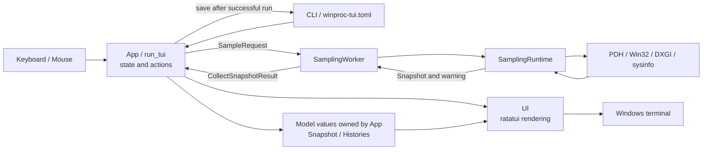
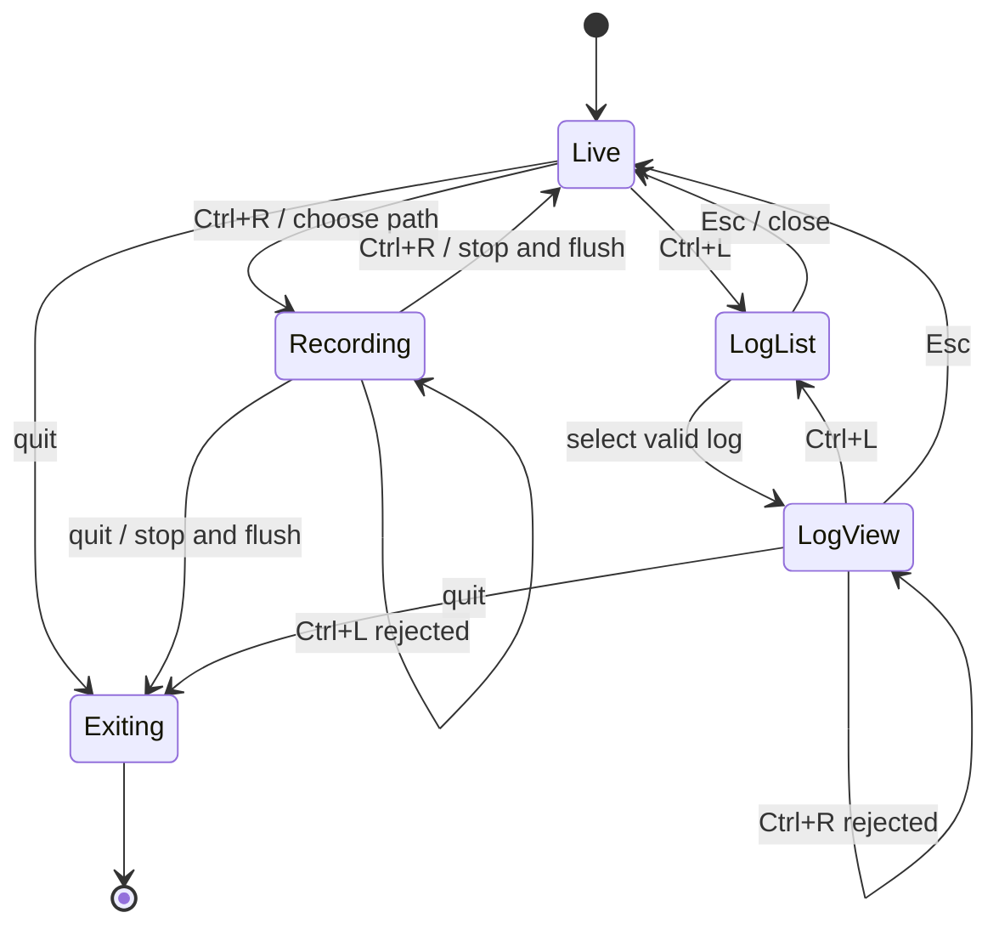

# winproc-tui Architecture

`winproc-tui` is a Windows 11 x64-only process monitoring TUI built with Rust 2024, ratatui, crossterm, Windows APIs, PDH, DXGI, and sysinfo.

This document describes responsibility boundaries, runtime data flow, design decisions, major state, and invariants that should survive implementation changes. It is not an exhaustive UI or key-binding specification. User-facing behavior belongs in the [README](../README.md), [Japanese README](../README.ja.md), and in-app [Help](../src/ui/help.rs); metric definitions and the recording schema belong in [metrics.md](metrics.md).

## 1. Overview

The application is coordinated by `App` and the single-threaded `run_tui` event loop. Sampling and other potentially slow Windows operations run outside the UI thread and return results asynchronously.

The diagram shows runtime data flow rather than a strict Rust module dependency graph. In particular, `ui` reads application state for rendering, while `app` also uses geometry helpers from `ui::layout` so drawing and mouse hit testing share the same rectangles.

## 2. Design Principles and Decisions

### 2.1 Keep the UI thread responsive

Windows counter and handle collection can block or take variable time. `SamplingWorker` therefore owns `SamplingRuntime` on a dedicated thread, and `App` exchanges requests and results through channels. Process information, Open Files collection, log-directory scans, and full log loading also use background work where blocking would otherwise affect input or drawing.

`App` permits only one sampling request to be in flight. A slow collection delays the next result instead of creating an unbounded queue of sampling work.

### 2.2 Redraw only when visible state changes

`run_tui` is dirty-driven: it calls `terminal.draw` after input, resize, an applicable worker result, or another visible state change. It does not redraw continuously between events.

Display pause captures the visible state rather than pausing collection. Live snapshots, histories, freshness, and recording continue to update in the background, while ordinary sample results do not trigger a redraw until display updates resume. Log view has its own loaded display state and does not support display pause.

### 2.3 Treat Windows metrics as best effort

Not every metric is available for every process. Access restrictions, process exit, unsupported hardware, and counter failures are represented as missing values or warnings rather than making the whole sample fail. UI formatting and recording omission rules are defined in [metrics.md](metrics.md).

Expensive process extras and GPU values are collected every five base samples and cached between slow samples. The base sampling interval is fixed at one second.

### 2.4 Separate tracking intent from process identity

The Tracked List stores case-insensitive process names because PIDs change when applications restart and one name may have multiple live instances. Histories and selections use `ProcessIdentity { pid, name, start_time }` so PID reuse or a restarted process does not merge unrelated samples.

Exited tracked processes remain available as Ghost Rows with their retained histories. Non-tracked processes do not receive the same long-lived retention.

### 2.5 Bound live history asymmetrically

Tracked processes retain 7,200 samples, approximately two hours at the one-second interval. Non-tracked processes retain 120 samples, approximately two minutes. System history also retains 7,200 samples.

This preserves useful investigation history for explicit targets without allowing every process on the system to consume two hours of memory. Loaded logs are reconstructed from their recorded frames and are not pruned to the live-history capacities.

### 2.6 Use JSON Lines for recording

Recording uses JSON Lines so frames can be appended incrementally, flushed on stop or quit, partially inspected after interruption, and processed without constructing one in-memory document. The reader builds a lightweight log-list summary from only the first and last non-empty records; it parses all frames only after a log is selected.

The record types, fields, units, and missing-value rules are specified in [metrics.md](metrics.md).

## 3. Main Components

| Component | Responsibility |
|---|---|
| `main`, `cli`, `config`, `platform` | Process startup, console control handling, terminal setup/restoration, CLI parsing, TOML persistence, and small Windows helpers. |
| `app` | Main loop, application state, input dispatch, navigation, tracking, Graph/A/B state, recording, log loading, clipboard actions, and worker coordination. |
| `model` | UI-independent snapshots, process/system values, column and sorting definitions, identities, and history containers. |
| `samplers` | Collection through sysinfo, PDH, Win32, DXGI, and process-specific helpers; owns the sampling worker/runtime boundary. |
| `ui` | ratatui composition, panels and modals, formatting, themes, and shared screen geometry. |

`model` is the data layer and does not depend on `ui` or `samplers`. `app` owns model values and coordinates the other components. The sampler produces model snapshots but does not mutate application or UI state directly.

## 4. Runtime Flow

### 4.1 Startup and shutdown

1. `main` parses the CLI, installs the Windows console control handler, resolves `winproc-tui.toml`, and builds `RuntimeConfig`.
2. `App::new` performs one synchronous initial collection so the first screen has data, initializes histories and selection state, and then spawns `SamplingWorker` for subsequent samples.
3. `main` enters raw mode and the alternate screen, then calls `run_tui`.
4. After the loop returns, `main` restores the terminal. It writes the current configuration only when `run_tui` succeeded, avoiding replacement of valid settings after a runtime failure.

Interactive quit goes through application cleanup. If recording is active, the end record is attempted and the writer is flushed and closed before exit. Windows console close, logoff, shutdown, `Ctrl+C`, and `Ctrl+Break` set a termination request that enters the same cleanup path; close-class events wait for a bounded period so the main loop and workers can finish. Dropping `SamplingWorker` sends `Stop` and joins its thread.

### 4.2 Main-loop cycle

Each `run_tui` iteration:

1. Applies completed sample, process-info, Open Files, and log-worker results.
2. Recalculates layout state and draws only when the dirty flag is set.
3. Polls terminal input with a bounded wait so worker results and console termination requests are checked promptly.
4. Dispatches key and mouse input to `App`; resize events invalidate the layout.
5. Requests the next sample when the one-second tick is due, unless a sample is already in flight or Log view is active.

Applying a live sample updates the current `Snapshot`, process and system histories, exited-tracked state, visible-row caches when appropriate, and the active recording. A warning can accompany an otherwise usable snapshot.

### 4.3 Sampling cycle

`SamplingRuntime::collect` refreshes sysinfo state, samples system and per-process PDH counters, applies Win32/DXGI-derived extras, and returns `CollectSnapshotResult { snapshot, warning }`.

The collection boundary deliberately produces one aggregate `Snapshot`. Individual collectors do not update `App`, histories, or widgets. Open Files is an explicit per-process investigation action rather than part of continuous sampling; it enumerates disk file handles only and remains off the UI thread.

## 5. State and Data Model

### 5.1 Snapshot and histories

`Snapshot` is the aggregate value for one capture time. It contains system memory, GPU, CPU, disk and activity values plus `Vec<ProcessRow>`. Unavailable process values are optional so access failure or process exit can be represented without fabricating a measurement.

`ProcessHistory` is keyed by `ProcessIdentity` and stores graphable samples and selected peaks. `SystemHistory` stores the system metrics used by RAM/VRAM, System Activity, and CPU graphs. Live histories apply the capacities described above; the log loader uses unbounded reconstruction for the selected recording.

Column selection and sorting are modeled separately through `MetricColumn`, `SortColumn`, `ColumnPreset`, and `SortSpec`. Metric semantics and display units remain centralized in [metrics.md](metrics.md).

### 5.2 Application state

`App` owns these state groups:

- sampling progress, the current live snapshot, freshness, and warning state;
- process-table selection, filtering, sorting, columns, and visible-row caches;
- tracking, process/system histories, and exited tracked rows;
- Graph slots, shared time/cursor/A/B state, and slot-specific display state;
- modal and asynchronous investigation state;
- display-pause, recording, Log list, and Log view state;
- runtime settings, theme, and transient action feedback.

Display accessors select live, paused, or loaded-log data without making widgets own activity-specific copies. `tracked_only` remains independent from whether the Tracked List is empty.

### 5.3 Graph and Samples state

Multiple Graph slots share the visible time span, cursor time, and A/B points. Y-axis scale, sample availability, target, metric, and displayed value remain slot-specific.

Navigation may choose the nearest useful timestamp, but a Graph displays a value only when that series has a sample at the selected captured time. This prevents one slot from presenting another slot's nearby sample as a synchronized value.

## 6. Input and UI Boundaries

Input dispatch follows these rules:

- Modal input has priority over the underlying panels.
- Filter editing accepts text-editing and confirm/cancel input instead of normal navigation.
- Non-modal actions depend on the current `FocusedPanel`.
- Key press and repeat events are handled; release events are ignored to avoid duplicate processing while preserving terminal key repeat.
- Drawing and mouse hit testing derive panel, Graph, Samples, scrollbar, and button regions from shared layout helpers.

The UI module renders state and exposes geometry helpers; it does not collect metrics or own histories. Exact colors, emphasis, cell widths, marker shapes, cursor-guide placement, and complete key lists are intentionally kept in implementation and rendering tests rather than duplicated here.

## 7. Recording and Log View

`Live`, `Recording`, and `LogView` are mutually constrained application activities. The Log list is a modal selection step, not a fourth activity.

Starting recording requires at least one configured Tracked List name. It does not require a current live match: each frame still records system metrics and writes an empty `processes` array until a matching process appears. Stopping or quitting attempts an `end` record, flushes the buffer, and closes the file.

Recording and Log view are mutually exclusive at both user-action and worker-result boundaries. `Ctrl+L` is rejected during Recording, `Ctrl+R` is rejected in Log view, and a completed background log load is rejected if Recording began while it was in flight.

The Log list scans supported `*.log` files on a background worker. Only schema version 2 is listed; malformed version 2 logs are reported without crashing the UI. Selecting a log triggers full background parsing. Log view shows the last process snapshot and the histories reconstructed from all frames; it does not play frames over time.

## 8. Invariants, Tests, and Constraints

The most important implementation invariants are:

- sampling and other expensive investigation work must not block the UI thread;
- display pause must not pause sampling, history updates, freshness, or recording;
- Recording and Log view must never be active together;
- stopping or quitting Recording must flush and close the log;
- tracked names, currently matching live processes, and per-instance process identities must remain distinct concepts;
- drawing and hit testing must use the same layout geometry;
- Graph shared state must not replace per-slot sample-availability checks;
- unavailable metrics must remain explicit rather than being converted to plausible values.

Unit tests live both beside modules and in `src/main.rs`. `SamplingWorker::test_pair` supports asynchronous state tests without a real collector, while ratatui `TestBackend` and buffer assertions cover layout, styling, and interaction-sensitive rendering. Exact UI details removed from this document should be protected by those implementation tests when they are intentional behavior.

Current constraints:

- Windows 11 x64 is the supported platform; Windows APIs are used directly.
- The base interval is fixed at one second, with selected slow metrics refreshed every five samples.
- Protected processes and unavailable counters may yield missing values.
- Live history is bounded and is not intended to be a long-term time-series database; recording provides the durable session format.

When behavior changes, update the canonical owner rather than duplicating it here: README and Help for user controls, [metrics.md](metrics.md) for values and recording fields, and [AGENTS.md](../AGENTS.md) for agent-facing workflow and regression rules.
