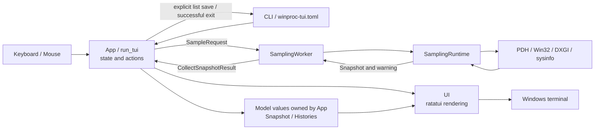
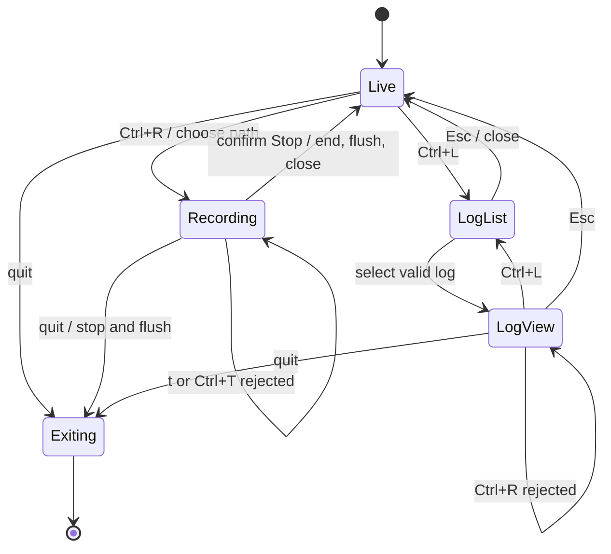

# winproc-tui Architecture

`winproc-tui` is a Windows 11 x64-only process monitoring TUI built with Rust 2024, ratatui, crossterm, Windows APIs, PDH, DXGI, and sysinfo.

This document describes responsibility boundaries, runtime data flow, design decisions, major state, and invariants that should survive implementation changes. It is not an exhaustive UI or key-binding specification. User-facing behavior belongs in the [README](../README.md), [Japanese README](../README.ja.md), and in-app [Help](../src/ui/help.rs); metric definitions and the recording schema belong in [metrics.md](metrics.md).

## 1. Overview

The application is coordinated by `App` and the single-threaded `run_tui` event loop. Sampling and other potentially slow Windows operations run outside the UI thread and return results asynchronously.

```mermaid
flowchart LR
    Input["Keyboard / Mouse"] --> App["App / run_tui<br/>state and actions"]
    Config["CLI / winproc-tui.toml"] --> App

    App -->|SampleRequest| Worker["SamplingWorker"]
    Worker --> Runtime["SamplingRuntime"]
    Runtime --> Windows["PDH / Win32 / DXGI / sysinfo"]
    Windows --> Runtime
    Runtime -->|Snapshot and warning| Worker
    Worker -->|CollectSnapshotResult| App

    App --> Model["Model values owned by App<br/>Snapshot / Histories"]
    App --> UI["UI<br/>ratatui rendering"]
    Model --> UI
    UI --> Terminal["Windows terminal"]
    App -->|explicit list save / successful exit| Config
```

The diagram shows runtime data flow rather than a strict Rust module dependency graph. In particular, `ui` reads application state for rendering, while `app` also uses geometry helpers from `ui::layout` so drawing and mouse hit testing share the same rectangles.

## 2. Design Principles and Decisions

### 2.1 Keep the UI thread responsive

Windows counter and handle collection can block or take variable time. `SamplingWorker` therefore owns `SamplingRuntime` on a dedicated thread, and `App` exchanges requests and results through channels. Process Image information, Process Info Files collection, loaded-DLL enumeration and file metadata, remote Environment reads, log-directory scans, and full log loading also use background work where blocking would otherwise affect input or drawing.

`App` permits only one sampling request to be in flight. A slow collection delays the next result instead of creating an unbounded queue of sampling work.

### 2.2 Redraw only when visible state changes

`run_tui` is dirty-driven: it calls `terminal.draw` after input, resize, an applicable worker result, or another visible state change. It does not redraw continuously between events.

Display pause captures the visible state rather than pausing collection. Live snapshots, histories, freshness, and recording continue to update in the background, while ordinary sample results do not trigger a redraw until display updates resume. Log view has its own loaded display state and does not support display pause.

### 2.3 Treat Windows metrics as best effort

Not every metric is available for every process. Access restrictions, process exit, unsupported hardware, and counter failures are represented as missing values or warnings rather than making the whole sample fail. UI formatting and recording omission rules are defined in [metrics.md](metrics.md).

Expensive process extras and GPU values are collected every five base samples and cached between slow samples. The base sampling interval is fixed at one second.

### 2.4 Separate tracking intent from process identity

The Tracking List stores case-insensitive process names because PIDs change when applications restart and one name may have multiple live instances. Histories and selections use `ProcessIdentity { pid, name, start_time }` so PID reuse or a restarted process does not merge unrelated samples.

Exited tracked processes remain available as Ghost Rows with their retained histories. Non-tracked processes do not receive the same long-lived retention.

### 2.5 Bound live history asymmetrically

Tracked processes retain 7,200 samples, approximately two hours at the one-second interval. Non-tracked processes retain 120 samples, approximately two minutes. System history also retains 7,200 samples.

This preserves useful investigation history for explicit targets without allowing every process on the system to consume two hours of memory. Loaded logs are reconstructed from their recorded frames and are not pruned to the live-history capacities.

### 2.6 Use JSON Lines for recording

Recording uses JSON Lines so frames can be appended incrementally, flushed on stop or quit, partially inspected after interruption, and processed without constructing one in-memory document. The reader builds a lightweight log-list summary from only the first and last non-empty records; it parses all frames only after a log is selected.

The record types, fields, units, and missing-value rules are specified in [metrics.md](metrics.md).

## 3. Main Components

| Component | Responsibility |
|---|---|
| `main`, `cli`, `config`, `platform` | Process startup, console control handling, terminal setup/restoration, CLI parsing, TOML persistence, and small Windows helpers. |
| `app` | Main loop, application state, input dispatch, navigation, tracking, Graph/A/B state, recording, log loading, clipboard actions, and worker coordination. |
| `model` | UI-independent snapshots, process/system values, column and sorting definitions, identities, and history containers. |
| `samplers` | Collection through sysinfo, PDH, Win32, DXGI, and process-specific helpers; owns the sampling worker/runtime boundary. |
| `ui` | ratatui composition, panels and modals, formatting, themes, and shared screen geometry. |

`model` is the data layer and does not depend on `ui` or `samplers`. `app` owns model values and coordinates the other components. The sampler produces model snapshots but does not mutate application or UI state directly.

## 4. Runtime Flow

### 4.1 Startup and shutdown

1. `main` parses the CLI and acquires a Windows session-local named mutex. A second instance exits before terminal setup or configuration access. The first instance then installs the Windows console control handler and resolves and loads `winproc-tui.toml`.
2. `main` enters raw mode and the alternate screen once for the complete interactive session. Startup mode then either resumes the previous working Tracking List, clears it, or opens a chooser for the previous working list, an empty list, or a saved named list. `Esc` restores the terminal and exits; `Enter` applies the selected choice before `RuntimeConfig` is built and before any sample is collected.
3. `App::new` performs one synchronous initial collection while the alternate screen remains active, so the first main screen has data without exposing the terminal prompt. It initializes histories and selection state, then spawns `SamplingWorker` for subsequent samples.
4. `main` calls `run_tui` using the same terminal session that covered startup and initial collection.
5. After the loop returns, `main` restores the terminal. It writes the current configuration only when `run_tui` succeeded, avoiding replacement of valid settings after a runtime failure. Tracking List startup changes and explicit Save, Save As, Rename, and Delete actions for named Tracking Lists persist immediately.

Interactive quit goes through application cleanup. If recording is active, the end record is attempted and the writer is flushed and closed before exit. Windows console close, logoff, shutdown, `Ctrl+C`, and `Ctrl+Break` set a termination request that enters the same cleanup path; close-class events wait for a bounded period so the main loop and workers can finish. Dropping `SamplingWorker` sends `Stop` and joins its thread.

### 4.2 Main-loop cycle

Each `run_tui` iteration:

1. Applies completed sample, process-info, Open Files, loaded-DLL, Environment, and log-worker results.
2. Recalculates layout state and draws only when the dirty flag is set.
3. Polls terminal input with a bounded wait so worker results and console termination requests are checked promptly.
4. Dispatches key and mouse input to `App`; resize events invalidate the layout.
5. Requests the next sample when the one-second tick is due, unless a sample is already in flight or Log view is active.

Applying a live sample updates the current `Snapshot`, process and system histories, exited-tracked state, visible-row caches when appropriate, and the active recording. A warning can accompany an otherwise usable snapshot.

### 4.3 Sampling cycle

`SamplingRuntime::collect` refreshes sysinfo state, samples system and per-process PDH counters, applies `GetPerformanceInfo` and Win32/DXGI-derived values, and returns `CollectSnapshotResult { snapshot, warning }`. GPU Engine, GPU Process Memory, and GPU Adapter Memory counters share one persistent query and are collected every second. DXGI adapter identity and capacity are initialized once and rechecked every five samples so a topology change can replace the cached static adapter list. System GPU values join PDH instances to that catalog by LUID; a PDH-only LUID never creates an adapter entry. The only five-second cached process extras are USER and GDI object counts.

The collection boundary deliberately produces one aggregate `Snapshot`. Individual collectors do not update `App`, histories, or widgets. Open Files is an explicit per-process investigation action rather than part of continuous sampling; it enumerates disk file handles only and remains off the UI thread.

## 5. State and Data Model

### 5.1 Snapshot and histories

`Snapshot` is the aggregate value for one capture time. It contains system memory, a LUID-keyed `Vec<GpuAdapterSample>`, CPU, disk and activity values plus `Vec<ProcessRow>`. Unavailable values are optional so access failure or process exit can be represented without fabricating a measurement. Per-process `WS Shrbl` is derived from the two same-sample PDH Working Set counters; normal sampling never enumerates pages with `QueryWorkingSet`.

`ProcessHistory` is keyed by `ProcessIdentity` and stores graphable samples and selected peaks. `SystemHistory` stores the metrics used by MEM, LUID-keyed GPU, System Activity, and CPU graphs. A GPU Graph source carries the adapter LUID so switching the visible adapter does not retarget an existing Graph. Live histories apply the capacities described above; the log loader uses unbounded reconstruction for the selected recording.

Column selection and sorting are modeled separately through `MetricColumn`, `SortColumn`, `ColumnPreset`, and `SortSpec`. Metric semantics and display units remain centralized in [metrics.md](metrics.md).

### 5.2 Application state

`App` owns these state groups:

- sampling progress, the current live snapshot, freshness, and warning state;
- process-table selection, filtering, sorting, columns, and visible-row caches;
- the working Tracking List, saved named lists, startup mode, process/system histories, and exited tracked rows;
- the ordered Graph collection, active Graph, shared time/cursor/A/B state, and Graph-specific display state;
- modal and asynchronous investigation state;
- display-pause, recording, Log list, and Log view state;
- runtime settings, theme, and transient action feedback.

Display accessors select live, paused, or loaded-log data without making widgets own activity-specific copies. `tracked_only` remains independent from whether the Tracking List is empty.

Process Info is one responsive modal with tab-specific scroll and collection state. Opening it fixes a `ProcessInfoDialogTarget` containing `ProcessIdentity`, the opening `ProcessRow`, and lifecycle. Every tab and worker request uses that target rather than consulting the current Processes selection again. The active tab remains session state after the dialog closes and is reused by ordinary Process Info opens; the direct Files action explicitly selects Files. Filters belong to one dialog session: tab switches and explicit refreshes preserve them, while opening a new Process Info session clears them. Files and DLL filtering use the full displayed path. DLL and Environment tabs separate their selectable lists from keyboard-scrollable detail views so complete metadata and values remain reachable on narrow terminals. A monotonically changing dialog generation accompanies Process Image, Files, DLL, and Environment requests, and DLL and Environment refreshes also have request ids, so a result from a closed, reopened, or superseded dialog request cannot update a newer session even when the same PID and identity are involved. DLL and Environment collection have independent workers from sampling, Image, and Open Files. All live collectors reject a target that exits or changes identity during collection. Environment's PEB offsets, pointer-width handling, memory-region validation, 4 MiB cap, and UTF-16 parser remain inside the platform-facing collector; UI and recording code receive only typed entries or typed errors. Environment results are cleared when the dialog closes and never enter recording state. Log view uses recorded display state for Metrics and Image fallbacks and never starts live Process Info collection.

The working Tracking List is separate from saved named definitions. Plain `t` edits only the working copy, while `Shift+T` changes the independent `tracked_only` state. The Tracking Lists dialog prepends a virtual `Empty (default)` entry to the saved definitions; it is active only when no named definition is active and the working list is empty, and it is never persisted, renamed, deleted, or overwritten. Loading either the virtual empty entry or a saved list replaces the working copy without changing `tracked_only`, while Save or Save As explicitly updates persistent definitions. Removing names during a load follows the same bounded-history pruning rule as manual untracking and requires confirmation when older retained samples would be discarded.

### 5.3 Graph and Samples state

Graphs are stored as an ordered `Vec<GraphEntry>` with a limit of 16. Each entry has a monotonically increasing, run-unique `GraphId` and one `GraphSlot` source. A removed ID is never reused, entries have no holes or duplicate sources, and a non-empty collection always has an `active_graph_id` that resolves to one entry. Process Graph sources retain a full `ProcessIdentity`, not a visible row or PID alone. Graph registrations, IDs, and scroll position are session state and are not written to settings.

The collection shares one absolute `captured_at`-based visible time window, live-follow state, selected sample time, A/B timestamps, and Y-axis lower-bound mode. The shared right edge is derived from the latest sample across the registered Graphs; each series is plotted against that common reference rather than its own latest sample. `Fit all` spans from the earliest first sample through the latest last sample across all registered Graphs, so changing the active Graph cannot change the fitted window. Process Info also consumes the shared A/B timestamps for the process fixed when its dialog opens. Y-axis scale, sample availability, target, metric, and displayed values remain Graph-specific. Navigation may choose the nearest useful timestamp, but a Graph displays a value only when that series has a sample at the exact selected `captured_at`. This prevents one Graph from presenting another Graph's nearby sample as synchronized data. When the selected sample moves outside the shared visible time window, the window shifts only far enough to include it; selections already inside the window do not move it.

`GraphSlotLayout` selects Auto or a row-major grid of one, two, or three columns. Auto chooses up to three columns while preserving the minimum card width; it does not depend on Processes count or vertical capacity. Explicit multi-column layouts fall back to fewer columns when the requested count does not fit. A single Graph always uses the full width. Cards are vertically scrollable by layout row, and selection adjusts the scroll position only enough to reveal the active card. Each card title calculates `B-A` from that Graph's exact metric samples and shows `--` when either point or value is unavailable. Layout and explicit Samples / Delta preferences are persisted in `winproc-tui.toml`.

One Samples inspector is bound to the active Graph. It is placed to the right when Graph and Samples minimum widths fit, below when their minimum heights fit, and otherwise temporarily collapsed. The explicit user preference and temporary collapse are separate state, so a resize restores only the latter. Multi-column cards and Samples may coexist when their minimum widths fit. Changing the active Graph aligns Samples to the shared selected time without replacing a missing exact-time value with a nearby one.

Graph assignment is independent from terminal geometry and Workspace visibility. A resize preserves entries, order, active ID, A/B points, selected time, and live-follow state; it recalculates Samples placement and effective columns, clamps row scroll, and minimally reveals the active card. When even one readable plot does not fit, the active card retains its title and remove action and renders a resize message. The Processes panel retains at least one selected data row when it has rows to show.

`GraphWorkspaceLayout` is the single geometry result for shared controls, the titled Graph panel and viewport, visible cards and their title/remove/plot regions, Graph scrollbar, and the Samples inspector. Drawing and mouse hit testing consume those same rectangles. Only cards intersecting the current row viewport perform Graph-series rendering work; the active Samples series may still be resolved when its card is outside the viewport.

Process Info applies the stricter same-time invariant to every metric: it resolves each A, B, or displayed-current sample once by exact `ProcessIdentity` and exact `captured_at`, then derives all metric rows from those resolved samples. Display accessors keep paused and loaded-log histories separate from the updating live history.

## 6. Input and UI Boundaries

Input dispatch follows these rules:

- Modal input has priority over the underlying panels.
- Process Info tab, close-button, content, and scrollbar hit regions are derived from the same centered dialog layout used for drawing. Clicking outside the dialog neither dismisses it nor operates the underlying panels.
- Process Info opens with its retained active tab focused, then cycles focus through Tabs, Content, and Close. Plain Left and Right switch tabs only while Tabs has focus, leaving Content free to use those keys for filter editing. Tab activation preserves the fixed dialog target, tab-specific state, lazy collection, and worker-generation boundaries.
- Filter editing accepts text-editing and confirm/cancel input instead of normal navigation.
- Non-modal actions depend on the current `FocusedPanel`.
- MEM and GPU share `FocusedPanel::System`, while `ResourcePanel` acts as its subfocus. The forward focus cycle visits MEM then GPU, and the reverse cycle visits GPU then MEM; drawing and input both consume this combined state.
- Key press and repeat events are handled; release events are ignored to avoid duplicate processing while preserving terminal key repeat.
- Drawing and mouse hit testing derive panel, Graph Workspace, card, Samples, scrollbar, and button regions from shared layout helpers. Processes table rendering, horizontal visibility, cell formatting, and header hit testing consume the same identity-based resolved column widths. Display-only truncation cues never replace the complete process name or executable path held in application state.
- Source double-click state stores the semantic `GraphSlot` and click time rather than screen coordinates. Scroll, drag, modal input, a different source, or more than 500 ms between clicks prevents the pair from adding or removing a Graph.

The UI module renders state and exposes geometry helpers; it does not collect metrics or own histories. When Graphs are visible, the shared main-panel layout derives the Processes height and page size from filtered visible rows plus the optional Tracked Total row, capped at the existing panel maximum while reserving Graph Workspace space. Drawing, offset clamping, focus and mouse hit testing consume the same main-panel and Graph Workspace layout results. When Graphs are hidden, the Processes panel continues to use the full lower body. Exact colors, emphasis, cell widths, marker shapes, cursor-guide placement, and complete key lists are intentionally kept in implementation and rendering tests rather than duplicated here.

## 7. Recording and Log View

`Live`, `Recording`, and `LogView` are mutually constrained application activities. The Log list is a modal selection step, not a fourth activity.

```mermaid
stateDiagram-v2
    [*] --> Live

    Live --> Recording: Ctrl+R / choose path
    Recording --> Recording: Ctrl+R / confirm stop
    Recording --> Live: confirm Stop / end, flush, close

    Live --> LogList: Ctrl+L
    LogView --> LogList: Ctrl+L
    LogList --> LogView: select valid log
    LogList --> Live: Esc / close
    LogView --> Live: Esc

    Recording --> Recording: Ctrl+L rejected
    Recording --> Recording: t or Ctrl+T rejected
    LogView --> LogView: Ctrl+R rejected

    Live --> Exiting: quit
    Recording --> Exiting: quit / stop and flush
    LogView --> Exiting: quit
    Exiting --> [*]
```

Starting recording requires at least one configured Tracking List name. It does not require a current live match: each frame still records system metrics and writes an empty `processes` array until a matching process appears. `RecordingSession` owns a copy of the working Tracking List and its normalized lookup set, and both session metadata and every frame use that fixed scope. Plain `t` and `Ctrl+T` reject Tracking List changes during Recording; `Shift+T` remains available because `tracked_only` is independent display state.

`Ctrl+R` opens a stop confirmation whose initial action is Continue. Sampling and frame writes continue while it is open, and the log is ended, flushed, and closed only after Stop is confirmed. Quit retains its existing single confirmation and performs the same writer cleanup directly rather than nesting the stop confirmation.

Recording lifecycle failures are application state, not status-only feedback. A create/open failure keeps the path dialog available behind the error; a header, frame, end, newline, or flush failure drops the active session, preserves any partial file, and shows a recording error. A failure while quitting cancels the quit so the error remains visible. Error state renders above other recording and quit modals.

Recording and Log view are mutually exclusive at both user-action and worker-result boundaries. `Ctrl+L` is rejected during Recording, `Ctrl+R` is rejected in Log view, and a completed background log load is rejected if Recording began while it was in flight.

The Log list scans supported `*.log` files on a background worker. Only schema version 2 is listed; malformed version 2 logs are reported without crashing the UI. Selecting a log triggers full background parsing. Log view shows the last process snapshot and the histories reconstructed from all frames; it does not play frames over time.

## 8. Invariants, Tests, and Constraints

The most important implementation invariants are:

- sampling and other expensive investigation work must not block the UI thread;
- only one `winproc-tui` instance may run in a Windows session, and a second launch must exit before terminal setup or configuration access;
- display pause must not pause sampling, history updates, freshness, or recording;
- Recording and Log view must never be active together;
- one Recording session must use one fixed Tracking List copy for its session record, frame metadata, and process filtering;
- stopping or quitting Recording must flush and close the log, and cleanup failure must remain visible instead of exiting silently;
- tracked names, currently matching live processes, and per-instance process identities must remain distinct concepts;
- the working Tracking List must not overwrite a saved named definition without an explicit save action;
- the built-in empty Tracking List must remain virtual and must not be stored among saved named definitions;
- drawing and hit testing must use the same layout geometry;
- dynamic Processes sizing must reserve a visible Tracked Total row, keep at least one process row when available, and give reclaimed height to Graphs without changing the full-height Graphs-hidden layout;
- terminal resizes, Tracked-only changes, and layout transitions must preserve the ordered Graph collection, active ID, and comparison state while keeping every Graph reachable by row scrolling;
- a non-empty Graph collection must contain at most 16 unique sources and have one valid active ID whose numeric value is never reused during the run;
- two-column Graph layout and the active Samples inspector must be able to coexist;
- shared Graph time state must not replace Graph-specific exact-time sample-availability checks;
- Process Info comparisons must not substitute a nearby time or a different process identity;
- all Process Info tabs must retain the target fixed when the dialog opened, and asynchronous results must match both its identity and dialog generation;
- unavailable metrics must remain explicit rather than being converted to plausible values.

Unit tests live both beside modules and in `src/main.rs`. `SamplingWorker::test_pair` supports asynchronous state tests without a real collector, while ratatui `TestBackend` and buffer assertions cover layout, styling, and interaction-sensitive rendering. Exact UI details removed from this document should be protected by those implementation tests when they are intentional behavior.

Current constraints:

- Windows 11 x64 is the supported platform; Windows APIs are used directly.
- The base interval is fixed at one second, with selected slow metrics refreshed every five samples.
- Protected processes and unavailable counters may yield missing values.
- Live history is bounded and is not intended to be a long-term time-series database; recording provides the durable session format.

When behavior changes, update the canonical owner rather than duplicating it here: README and Help for user controls, [metrics.md](metrics.md) for values and recording fields, and [AGENTS.md](../AGENTS.md) for agent-facing workflow and regression rules.
