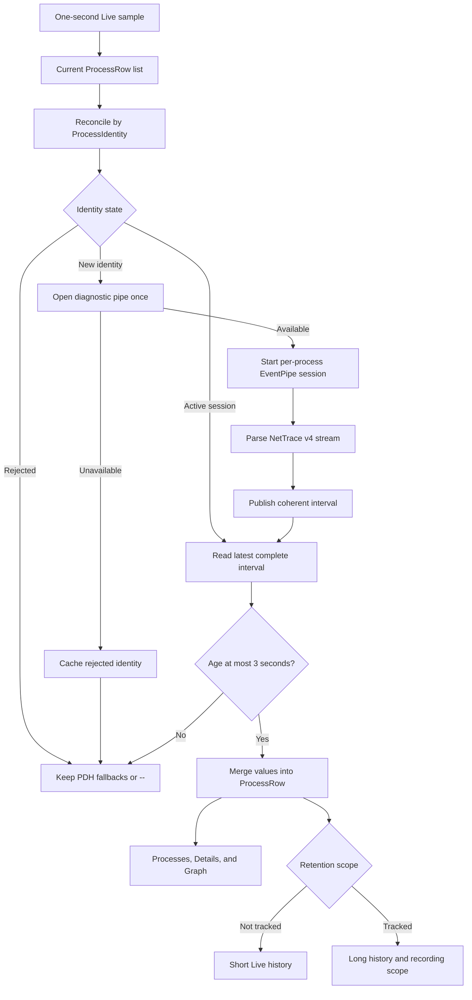
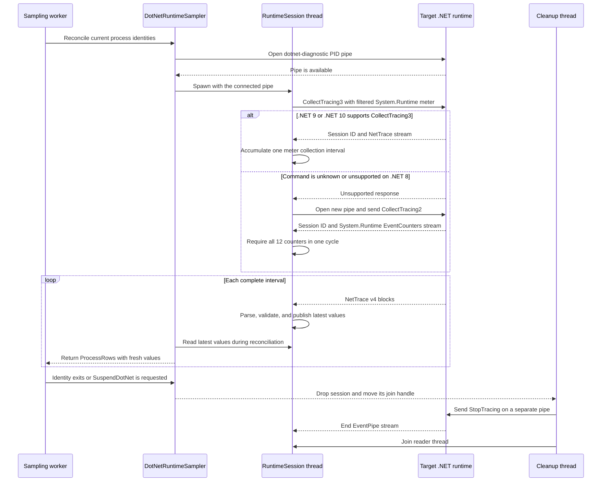

# .NET Runtime Metrics Collection

This implementation note explains how `winproc-tui` detects managed processes and collects the .NET runtime metrics exposed in the Processes table. Metric meanings, units, and recording fields remain normative in [metrics.md](metrics.md); runtime ownership and data flow remain normative in [architecture.md](architecture.md).

## Scope

The live sampling worker attempts collection for every live process identity, regardless of Tracking List membership. A process is identified by `(PID, name, start_time)` so PID reuse cannot attach an old session or cached detection result to a new process.

| Target | Collection path | Available values |
|---|---|---|
| .NET 9 and .NET 10 | Diagnostics IPC, EventPipe, `System.Diagnostics.Metrics`, and the `System.Runtime` meter | All nine .NET columns when the runtime publishes complete intervals |
| .NET 8 | Diagnostics IPC, EventPipe, and `System.Runtime` EventCounters | All nine .NET columns when one complete EventCounter cycle is available |
| .NET Framework 4.8 | Legacy PDH `.NET CLR Memory` counters | `.NET Heap`, `.NET Gen1`, `.NET Gen2`, and `.NET LOH` |
| Native process or inaccessible managed process | No EventPipe session | Unavailable values (`--`) |

WinUI 3 is not detected as a special application type. A managed WinUI 3 process is supported when it runs on a supported .NET runtime and exposes the diagnostics pipe. A native-only WinUI 3 process does not expose these managed runtime metrics.

The initial synchronous startup sample does not open .NET sessions. EventPipe collection begins in the persistent live sampling worker. Log view does not run live .NET collection.

.NET Framework 4.8 does not expose a POH generation. Its PDH `Gen 0 heap size` counter is the maximum allocation threshold before the next Gen0 collection, not the current Gen0 heap occupancy represented by the modern runtime values. The collector therefore leaves Framework Gen0 and POH unavailable instead of placing semantically different data in those columns.

## End-to-End Flow

1. The one-second live sample builds the current `ProcessRow` list.
2. `DotNetRuntimeSampler::reconcile_and_apply` converts every row to a full `ProcessIdentity` and removes state for identities that have exited.
3. For an identity not already classified, the sampler tries to open `\\.\pipe\dotnet-diagnostic-{pid}` once. Opening the pipe is both the initial .NET detection check and the first connection used to start collection.
4. A successful check creates one independent `dotnet-runtime-{pid}` thread and caches the identity as detected. A failed initial check caches the identity as rejected for the rest of that process lifetime.
5. The session requests a filtered, one-second EventPipe stream and parses the raw NetTrace v4 FastSerialization data in process.
6. An accumulator publishes only a coherent collection interval. The session retains only its most recently published interval.
7. The next live sample copies fresh values into the matching `ProcessRow`. An EventPipe value overrides its legacy PDH fallback only when that EventPipe value exists.

Detection does not inspect loaded modules, executable names, or application frameworks. It relies on the runtime-owned diagnostics pipe, which avoids a separate module-enumeration pass over every process.

### Collection Flow



## Diagnostics IPC Session

`src/samplers/dotnet_runtime.rs` implements the required subset of the .NET diagnostics IPC protocol directly. It does not start `dotnet-counters`, load a profiler, inject code, or require a managed helper process.

Packets use the `DOTNET_IPC_V1` magic value and the runtime's named pipe. The first request attempts the newer CollectTracing command with explicit stack suppression and a single `System.Diagnostics.Metrics` provider. Its provider arguments are equivalent to:

```text
SessionId=SHARED
ClientId=winproc-tui-<target-pid>-<collector-pid>-<nonce>
RefreshInterval=1
Metrics="System.Runtime\dotnet.gc.heap.total_allocated;
         System.Runtime\dotnet.gc.last_collection.memory.committed_size;
         System.Runtime\dotnet.gc.last_collection.heap.size;
         System.Runtime\dotnet.gc.last_collection.heap.fragmentation.size"
MaxTimeSeries=32
MaxHistograms=0
```

The actual request encodes these arguments as one semicolon-separated UTF-16 string. Filtering at the provider limits the stream to the four instruments needed to derive the nine displayed values.

If the runtime reports the newer CollectTracing command as unknown or unsupported, the sampler opens a new pipe and sends the older CollectTracing command with only the `System.Runtime` provider and `EventCounterIntervalSec=1`. This protocol fallback selects the .NET 8 path without maintaining a separate runtime-version detector. It also avoids opening both modern and legacy counter sessions on a newer runtime.

## .NET 9 and .NET 10 Mapping

The `System.Diagnostics.Metrics` provider emits collection boundaries and instrument values for the filtered `System.Runtime` meter. Values are published at the collection-stop event.

| Display value | Instrument | Processing |
|---|---|---|
| `.NET Heap` | `dotnet.gc.last_collection.heap.size` | Sum `gen0`, `gen1`, `gen2`, `loh`, and `poh` |
| `.NET Gen0` | `dotnet.gc.last_collection.heap.size` | Use the value tagged `gc.heap.generation=gen0` |
| `.NET Gen1` | `dotnet.gc.last_collection.heap.size` | Use the value tagged `gc.heap.generation=gen1` |
| `.NET Gen2` | `dotnet.gc.last_collection.heap.size` | Use the value tagged `gc.heap.generation=gen2` |
| `.NET LOH` | `dotnet.gc.last_collection.heap.size` | Use the value tagged `gc.heap.generation=loh` |
| `.NET POH` | `dotnet.gc.last_collection.heap.size` | Use the value tagged `gc.heap.generation=poh` |
| `.NET Commit` | `dotnet.gc.last_collection.memory.committed_size` | Use the untagged value |
| `.NET Frag` | `dotnet.gc.last_collection.heap.fragmentation.size` | Sum `gen0`, `gen1`, `gen2`, `loh`, and `poh` |
| `.NET Alloc/s` | `dotnet.gc.heap.total_allocated` | Use the provider's rate value and round to bytes/s |

Heap and fragmentation are unavailable unless all five generations are present in the same interval. The sampler does not publish a partial sum because that would silently undercount the runtime value. The allocation rate normally needs a previous interval, so a newly opened .NET 9/10 session can take about two collection intervals before every value is visible.

## .NET 8 Mapping

The fallback reads these `System.Runtime` EventCounters:

| Display value | EventCounter | Conversion |
|---|---|---|
| `.NET Heap` | `gc-heap-size` | Decimal MB multiplied by 1,000,000 and rounded to bytes |
| `.NET Gen0` | `gen-0-size` | Use the byte value |
| `.NET Gen1` | `gen-1-size` | Use the byte value |
| `.NET Gen2` | `gen-2-size` | Use the byte value |
| `.NET LOH` | `loh-size` | Use the byte value |
| `.NET POH` | `poh-size` | Use the byte value |
| `.NET Commit` | `gc-committed` | Decimal MB multiplied by 1,000,000 and rounded to bytes |
| `.NET Frag` | `gc-fragmentation` | Percentage multiplied by the same cycle's heap size, then rounded to bytes |
| `.NET Alloc/s` | `alloc-rate` | Increment divided by the reported interval |

All nine counters must arrive in one logical cycle before the accumulator publishes values. If a counter repeats before the cycle is complete, the incomplete cycle is discarded and accumulation restarts. This prevents values from different refresh intervals from being combined.

## .NET Framework 4.8 Mapping

The persistent process PDH query reads the runtime instance's `Process ID` counter and joins values to the ordinary process rows by PID.

| Display value | `.NET CLR Memory` counter | Processing |
|---|---|---|
| `.NET Heap` | `# Bytes in all Heaps` | Use the byte value |
| `.NET Gen1` | `Gen 1 heap size` | Use the byte value |
| `.NET Gen2` | `Gen 2 heap size` | Use the byte value |
| `.NET LOH` | `Large Object Heap size` | Use the byte value |
| `.NET Gen0` | Not collected | The available `Gen 0 heap size` counter is an allocation threshold, not current occupancy |
| `.NET POH` | Not available | .NET Framework has no POH generation |

These PDH values remain available even though .NET Framework does not expose the .NET Core diagnostics named pipe. They use the same existing one-second PDH query as the other process counters and do not create per-process EventPipe threads.

## NetTrace Parsing and Validation

The collector reads the EventPipe stream directly rather than depending on a general-purpose trace library. The parser accepts NetTrace v4 FastSerialization objects, metadata blocks, event blocks, compressed and uncompressed event headers, and only the two providers needed by this feature.

Defensive limits include:

- a 16 MiB maximum EventPipe block;
- a 64-byte maximum FastSerialization type name;
- bounded UTF-16 strings;
- checked lengths, offsets, integer conversions, and generation sums;
- rejection of negative, non-finite, or invalid interval values.

An unsupported stream version, malformed block, truncated stream structure, or pipe failure ends only that process's runtime session. A malformed value payload is ignored. Neither case fails the complete process snapshot.

## Freshness, Retry, and Shutdown

- A published interval is applied only for three seconds. Older values become unavailable instead of remaining frozen indefinitely.
- If an established session ends, that detected identity waits five seconds before another connection attempt.
- A failed initial detection is not retried for the same identity. This keeps the recurring reconciliation cost small for the much larger set of native processes.
- Exited identities are removed on the next live reconciliation.
- Entering Log view sends `SuspendDotNet`, which clears sessions and detection caches. Returning to Live performs detection again against the current identities.

Stopping a session must not delay the sampling worker or the UI. Dropping `RuntimeSession` sets a stop flag, moves its join handle to a short-lived `dotnet-runtime-cleanup-{pid}` thread, opens a separate diagnostics pipe, and sends the EventPipe stop command using the stored session ID. The cleanup thread then joins the reader. An atomic guard prevents duplicate stop requests.

### Session Negotiation and Shutdown



## Display, History, and Recording Boundaries

Detection and current value display are independent of Tracking List membership. History and persistence remain intentionally asymmetric:

- every detected live process may show current .NET values;
- non-tracked processes keep only the ordinary short live history;
- tracked processes keep the long live history;
- recording includes only processes in the recording session's fixed tracked scope;
- unavailable values are displayed as `--` and omitted from object-based recording fields, while fixed-order schema positions use `null`.

## Expected Cost

The UI thread performs no diagnostics IPC or trace parsing. The one-second sampling worker performs identity reconciliation and copies the latest published values; each detected runtime has a dedicated blocking reader thread.

The Issue #75 development benchmark used 20 idle .NET processes on a 20-logical-CPU machine. The then-current 12-value .NET 8 collector observed:

- initial .NET 8 pipe detection in approximately 1.2-2 ms;
- all 12 .NET 8 values available after approximately 1.16 s;
- reconciliation after sessions were established over 1,000 calls at 4.6 microseconds p50, 4.8 microseconds p99, and 18.3 microseconds maximum per call;
- target-process overhead totaling approximately 0.42-0.86 CPU-seconds over 10 seconds across all 20 processes, or about 0.21-0.43% of total machine capacity;
- collector overhead of approximately 0.03% of total machine CPU capacity;
- collector growth of approximately 1.5 MiB working set and 1.9 MiB private bytes;
- asynchronous session stop completion in approximately 0.5-2.7 ms.

These figures are point-in-time development measurements, not a performance guarantee. The five generation-size EventCounters share the existing `System.Runtime` provider, one-second session, parser, and latest-value cache; they do not add sessions or diagnostic-pipe round trips. Active allocation or GC workloads can increase the target-side cost and emitted event volume. A .NET 9 process can require roughly 2.2 s for the complete first interval because rate instruments need the preceding interval.

## Maintenance Checklist

When changing this collector:

1. Keep metric definitions and units synchronized with [metrics.md](metrics.md).
2. Update both modern meter filtering and the relevant accumulator when adding an instrument.
3. Preserve complete-interval publication and missing-value semantics.
4. Keep pipe I/O and parsing outside the UI thread.
5. Keep shutdown asynchronous and bounded from the caller's perspective.
6. Check `model::columns`, `model::process`, `model::snapshot`, UI formatting, Details, clipboard output, history, and recording schemas.
7. Cover request encoding, parser bounds, version fallback, conversions, and lifecycle behavior with focused tests before running the full Rust test suite.
